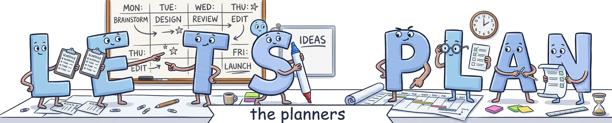
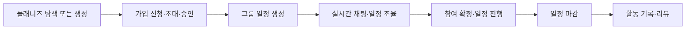
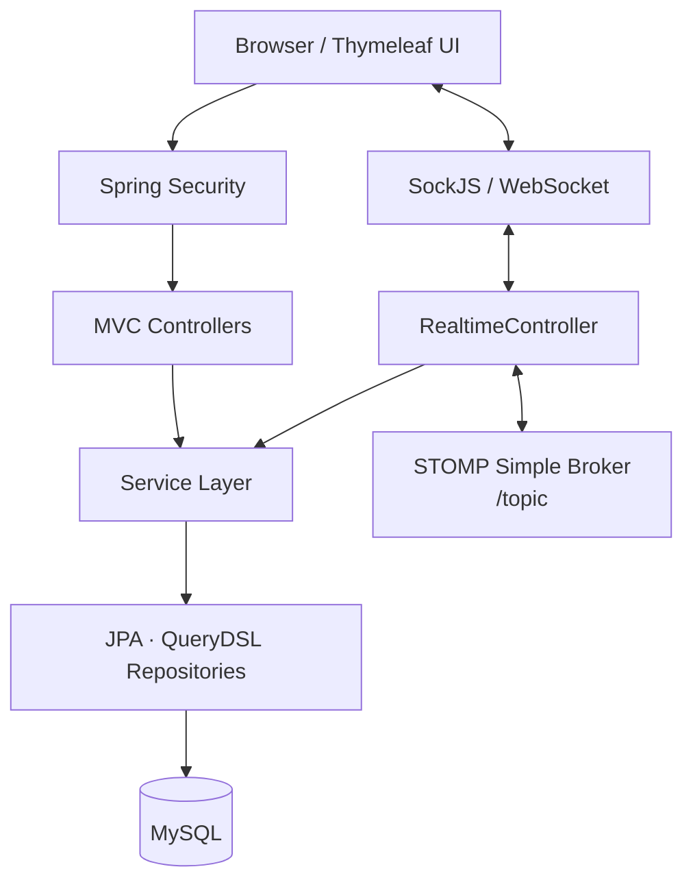

[🌐 웹 포트폴리오 보러가기](https://developer-portfolio.changy.workers.dev/)

<div align="center">
  

  <h1>Let's Plan</h1>

  <p><strong>실시간 그룹 일정 조율 및 협업 플랫폼</strong></p>
  <p>
    관심사가 맞는 사람을 찾고, 함께 계획을 세우고,<br />
    실시간으로 일정을 조율한 뒤 기록과 리뷰까지 남길 수 있는 서비스입니다.
  </p>
</div>

<div align="center">


</div>

## 서비스 소개

> "카톡에 말 다 하고, 노션에서 표 만들고"
>
> "취미는 같다는데, 만나보면 따로 놀아"

여러 도구에 흩어진 대화와 계획을 하나의 흐름으로 연결하기 위해 시작한 프로젝트입니다.

Let's Plan은 단순히 관심사가 같은 사람을 모으는 데서 그치지 않습니다. 지역, 취미, 참여 조건에 맞는 플래너즈를 탐색하고, 채팅과 시각화된 일정 보드를 이용해 구성원들이 실제로 함께 움직일 수 있는 계획을 완성하도록 돕습니다.

### 핵심 가치

- **함께 시작하는 계획**: 혼자 준비하는 부담은 줄이고 참여의 재미는 높입니다.
- **활동 중심의 커뮤니티**: 같은 관심사뿐 아니라 즐기는 방식과 계획까지 연결합니다.
- **실시간 협업**: 채팅, 참여자 상태, 드래그 앤 드롭 일정 조율을 한 화면에서 제공합니다.
- **완결된 사용자 여정**: 플래너즈 탐색부터 일정 마감과 리뷰까지 하나의 서비스 안에서 이어집니다.

## 주요 기능

| 기능 | 설명 |
| --- | --- |
| 플래너즈 탐색 | 최근 활동, 인기 플래너즈, 지역·취미 카테고리 기반 추천, 키워드 검색과 필터링을 제공합니다. |
| 플래너즈 생성 및 운영 | 썸네일·배너, 참여 인원, 공개 여부를 설정하고 운영자가 정보와 구성원을 관리할 수 있습니다. |
| 가입·초대·승인 | 플래너즈 가입 신청, 승인·거절, 친구 초대, 초대 수락·거절과 탈퇴 흐름을 지원합니다. |
| 일정 생성 | 제목, 설명, 기간, 시간, 참여 인원, 썸네일을 설정해 그룹 일정을 등록할 수 있습니다. |
| 실시간 일정 조율 | WebSocket/STOMP 기반 채팅과 참여자 상태 공유, 활동 블록 드래그 앤 드롭을 지원합니다. |
| 일정 라이프사이클 | 일정 참여·취소, 조정, 확정, 마감과 삭제까지 상태에 맞게 관리합니다. |
| 소셜 기능 | 친구 검색·요청·수락, 방명록, 즐겨찾기, 활동·일정·그룹 알림을 제공합니다. |
| 기록과 리뷰 | 종료된 일정과 참여 기록을 확인하고 플래너즈 평점 및 리뷰를 작성·수정·삭제할 수 있습니다. |

## 서비스 이용 흐름



## 기술 스택

| 구분 | 기술 |
| --- | --- |
| Backend | Java 17, Spring Boot 4.0.6, Spring MVC |
| Security | Spring Security, BCrypt |
| Data | Spring Data JPA, QueryDSL, MySQL |
| Realtime | WebSocket, STOMP, SockJS |
| Frontend | Thymeleaf, HTML5, CSS3, JavaScript |
| Build | Gradle 9.4.1 |
| Utilities | Lombok, Jackson |

## 아키텍처



애플리케이션은 Controller-Service-Repository 계층으로 역할을 분리합니다. 일반 요청은 Spring MVC와 Thymeleaf로 처리하고, 채팅·참여자 상태·일정 블록 이동과 같은 협업 이벤트는 WebSocket/STOMP 채널로 전달합니다.

## 프로젝트 구조

```text
src/main
├── java/com/example/project
│   ├── config        # Security, Web MVC, WebSocket 설정
│   ├── controller    # 화면·REST·실시간 메시지 진입점
│   ├── dto           # 요청·응답 및 실시간 통신 데이터
│   ├── entity        # 사용자, 플래너즈, 일정, 알림 등 도메인
│   ├── repository    # JPA 및 QueryDSL 데이터 접근
│   ├── security      # 인증 사용자와 로그인 처리
│   └── service       # 비즈니스 로직
└── resources
    ├── static        # CSS, JavaScript, 이미지
    ├── templates     # Thymeleaf 화면
    └── application.properties
```

## 시작하기

### 1. 준비 사항

- Java 17
- MySQL
- Git

Gradle은 Wrapper가 포함되어 있어 별도로 설치하지 않아도 됩니다.

### 2. 저장소 복제

```bash
git clone https://github.com/KwanEon/LetsPlan.git
cd LetsPlan
```

### 3. 데이터베이스 생성

```sql
CREATE DATABASE letsplan
  DEFAULT CHARACTER SET utf8mb4
  COLLATE utf8mb4_unicode_ci;
```

### 4. 애플리케이션 설정

`src/main/resources/application.properties`의 데이터베이스 접속 정보를 로컬 환경에 맞게 수정합니다.

```properties
spring.datasource.url=jdbc:mysql://localhost:3306/letsplan?serverTimezone=Asia/Seoul&characterEncoding=UTF-8
spring.datasource.username=YOUR_USERNAME
spring.datasource.password=YOUR_PASSWORD
spring.jpa.hibernate.ddl-auto=update

spring.servlet.multipart.location=C:/upload
com.example.upload.path=C:/uploads
```

현재 정적 업로드 리소스는 `WebConfig`에서 `C:/uploads`를 기준으로 제공됩니다. Windows에서는 `C:/upload`와 `C:/uploads` 디렉터리를 생성하고, 다른 운영체제에서는 `application.properties`와 `WebConfig`의 경로를 함께 변경해 주세요.

### 5. 실행

Windows:

```powershell
.\gradlew.bat bootRun
```

macOS / Linux:

```bash
./gradlew bootRun
```

실행 후 [http://localhost:8081](http://localhost:8081)에서 확인할 수 있습니다.

### 6. 테스트

Windows:

```powershell
.\gradlew.bat test
```

macOS / Linux:

```bash
./gradlew test
```

## 주요 경로

| 경로 | 설명 |
| --- | --- |
| `/` | 메인 화면 |
| `/planners/list` | 플래너즈 검색 및 목록 |
| `/planners/create` | 플래너즈 생성 |
| `/planners/mylist` | 내 플래너즈 관리 |
| `/planners/schedule` | 일정 목록 및 보드 |
| `/friends` | 친구 관리 |
| `/user/mypage` | 마이페이지 |
| `/ws/` | SockJS WebSocket 엔드포인트 |

<div align="center">
  <strong>계획을 대화로 끝내지 말고, 함께 실행해 보세요.</strong>
</div>
